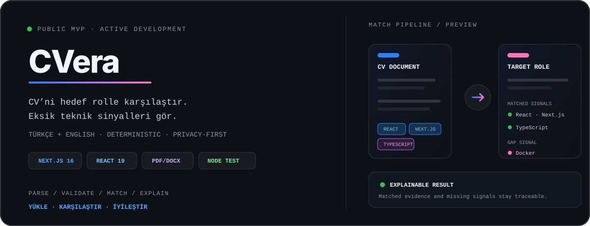

<picture>
  <source media="(prefers-color-scheme: dark)" srcset="./assets/header.svg" />
  <source media="(prefers-color-scheme: light)" srcset="./assets/header-light.svg" />
  
</picture>

## `01 / WHO I AM`

<picture>
  <source media="(prefers-color-scheme: dark)" srcset="./assets/terminal.svg" />
  <source media="(prefers-color-scheme: light)" srcset="./assets/terminal-light.svg" />
  
</picture>

Ürün düşüncesiyle çalışan, uçtan uca web uygulamaları geliştiren bir **Full-Stack Developer**'ım. Karmaşık akışları anlaşılır arayüzlere; fikirleri hızlı, güvenilir ve sürdürülebilir ürünlere dönüştürmeye odaklanıyorum.

<table>
  <tr>
    <td width="33%" align="center"><strong>PRODUCT THINKING</strong> Kullanıcı ihtiyacından çalışan ürüne</td>
    <td width="33%" align="center"><strong>CLEAR SYSTEMS</strong> Sade akışlar, belirgin sınırlar</td>
    <td width="33%" align="center"><strong>SHIP QUALITY</strong> Tip güvenliği, test ve iterasyon</td>
  </tr>
</table>

## `02 / STACK`

  
<strong>Frontend & Frameworks</strong>

  

    
  
<strong>Backend & Data</strong>

  

    
  
<strong>DevOps & System</strong>

  

## `03 / CURRENTLY SHIPPING`

<a href="https://github.com/umutgungorr/chronoflow">
<picture>
  <source media="(prefers-color-scheme: dark)" srcset="./assets/chronoflow.svg" />
  <source media="(prefers-color-scheme: light)" srcset="./assets/chronoflow-light.svg" />
  
</picture>
</a>

<table>
  <tr>
    <td width="33%"><strong>LOCAL-FIRST CORE</strong> Hesap veya bulut bağlantısı olmadan da çalışan planlama deneyimi.</td>
    <td width="33%"><strong>OPTIONAL SYNC</strong> Supabase ile isteğe bağlı cihazlar arası veri eşitleme.</td>
    <td width="33%"><strong>TESTED DOMAIN</strong> Planlama mantığı ve kritik akışlar Vitest ile doğrulanıyor.</td>
  </tr>
</table>

   
  PLANLA · ODAKLAN · TAMAMLA

<a href="https://github.com/umutgungorr/cvera">
<picture>
  <source media="(prefers-color-scheme: dark)" srcset="./assets/cvera.svg" />
  <source media="(prefers-color-scheme: light)" srcset="./assets/cvera-light.svg" />
  
</picture>
</a>

<table>
  <tr>
    <td width="33%"><strong>PRIVATE BY DESIGN</strong> Belgeler istek belleğinde işlenir; kalıcı depolamaya veya üçüncü taraf analiz servisine gönderilmez.</td>
    <td width="33%"><strong>EXPLAINABLE MATCH</strong> Eşleşen ve eksik teknik beceriler deterministik kurallarla görünür hâle gelir.</td>
    <td width="33%"><strong>DEFENSIVE INPUTS</strong> Dosya imzası, boyut, okunabilir içerik ve ilan kalitesi analizden önce doğrulanır.</td>
  </tr>
</table>

  
   
  YÜKLE · KARŞILAŞTIR · İYİLEŞTİR

## `04 / OPEN-SOURCE DEVELOPER TOOLING`

Sıfır bağımlılıklı (zero-dependency), hızlı ve güvenilir açık kaynak CLI geliştirici araçları serisi:

<table>
  <tr>
    <td width="33%" align="center">
      🛡️ <strong><a href="https://github.com/umutgungorr/tokenguard">TokenGuard</a></strong> 
      Git pre-commit gizli anahtar ve token tarayıcısı.  
      
      
    </td>
    <td width="33%" align="center">
      🩺 <strong><a href="https://github.com/umutgungorr/envdoctor">EnvDoctor</a></strong> 
      .env ve .env.example denetleyici, eşitleyici ve kod tarayıcı.  
      
      
    </td>
    <td width="33%" align="center">
      🔗 <strong><a href="https://github.com/umutgungorr/deadlinkfinder">DeadLinkFinder</a></strong> 
      Markdown yerel bağlantı, görsel ve başlık çapa doğrulayıcı.  
      
      
    </td>
  </tr>
</table>

## `05 / CONNECT`

**Bir fikri özenli ve çalışan bir ürüne dönüştürelim.**

Odaklı iş birliklerine, düşünülmüş ürünlere ve iddialı fikirlere açığım.

