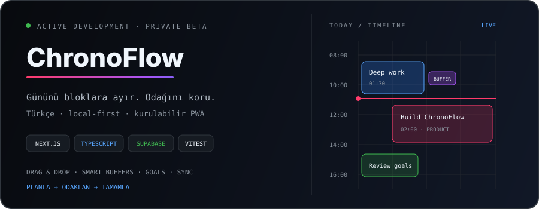

<picture>
  <source media="(prefers-color-scheme: dark)" srcset="./assets/header.svg" />
  <source media="(prefers-color-scheme: light)" srcset="./assets/header-light.svg" />
  
</picture>

## `01 / WHO I AM`

<picture>
  <source media="(prefers-color-scheme: dark)" srcset="./assets/terminal.svg" />
  <source media="(prefers-color-scheme: light)" srcset="./assets/terminal-light.svg" />
  
</picture>

Ürün düşüncesiyle çalışan, uçtan uca web uygulamaları geliştiren bir **Full-Stack Developer**'ım. Karmaşık akışları anlaşılır arayüzlere; fikirleri hızlı, güvenilir ve sürdürülebilir ürünlere dönüştürmeye odaklanıyorum.

<table>
  <tr>
    <td width="33%" align="center"><strong>PRODUCT THINKING</strong> Kullanıcı ihtiyacından çalışan ürüne</td>
    <td width="33%" align="center"><strong>CLEAR SYSTEMS</strong> Sade akışlar, belirgin sınırlar</td>
    <td width="33%" align="center"><strong>SHIP QUALITY</strong> Tip güvenliği, test ve iterasyon</td>
  </tr>
</table>

## `02 / STACK`

INTERFACE 
<picture>
  <source media="(prefers-color-scheme: dark)" srcset="https://skillicons.dev/icons?i=nextjs,react,ts,tailwind&theme=dark" />
  <source media="(prefers-color-scheme: light)" srcset="https://skillicons.dev/icons?i=nextjs,react,ts,tailwind&theme=light" />
  
</picture>

 

DATA &amp; RUNTIME 
<picture>
  <source media="(prefers-color-scheme: dark)" srcset="https://skillicons.dev/icons?i=nodejs,supabase,postgres&theme=dark" />
  <source media="(prefers-color-scheme: light)" srcset="https://skillicons.dev/icons?i=nodejs,supabase,postgres&theme=light" />
  
</picture>

 

DELIVERY &amp; QUALITY 
<picture>
  <source media="(prefers-color-scheme: dark)" srcset="https://skillicons.dev/icons?i=git,github,vitest,vercel,vscode&theme=dark" />
  <source media="(prefers-color-scheme: light)" srcset="https://skillicons.dev/icons?i=git,github,vitest,vercel,vscode&theme=light" />
  
</picture>

## `03 / CURRENTLY SHIPPING`

<picture>
  <source media="(prefers-color-scheme: dark)" srcset="./assets/chronoflow.svg" />
  <source media="(prefers-color-scheme: light)" srcset="./assets/chronoflow-light.svg" />
  
</picture>

<table>
  <tr>
    <td width="33%"><strong>LOCAL-FIRST CORE</strong> Hesap veya bulut bağlantısı olmadan da çalışan planlama deneyimi.</td>
    <td width="33%"><strong>OPTIONAL SYNC</strong> Supabase ile isteğe bağlı cihazlar arası veri eşitleme.</td>
    <td width="33%"><strong>TESTED DOMAIN</strong> Planlama mantığı ve kritik akışlar Vitest ile doğrulanıyor.</td>
  </tr>
</table>

  

PLANLA · ODAKLAN · TAMAMLA

## `04 / CONNECT`

**Bir fikri özenli ve çalışan bir ürüne dönüştürelim.**

Odaklı iş birliklerine, düşünülmüş ürünlere ve iddialı fikirlere açığım.

